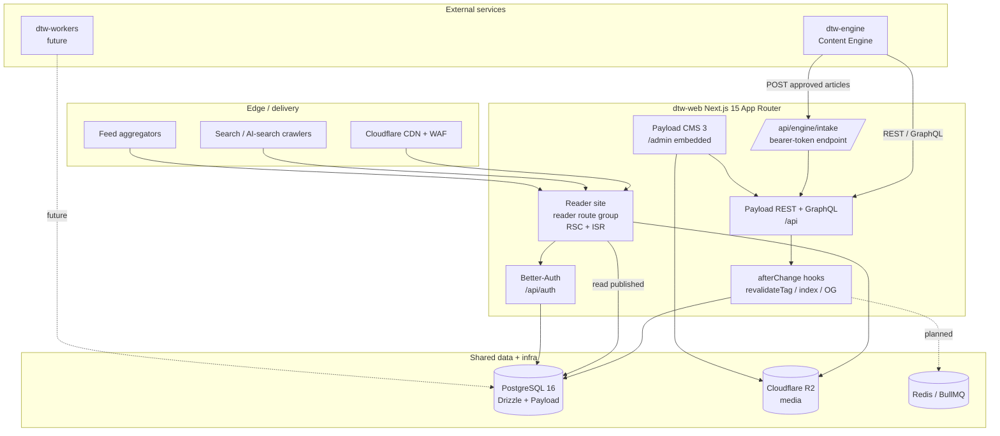
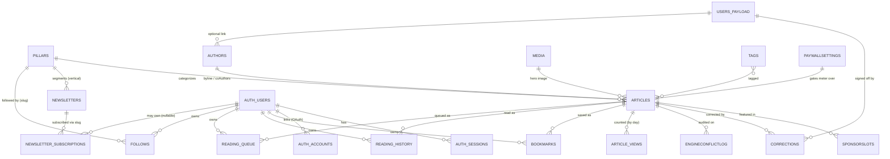

# DTW Web — Software Requirements Specification

| Field | Value |
|---|---|
| **Product** | DTW Web (`dtw-web`) — Dailytechwire reader site + embedded Payload CMS |
| **Document** | Software Requirements Specification (SRS) |
| **Version** | 1.0 |
| **Date** | 2026-07-28 |
| **Status** | Draft |
| **Standard** | ISO/IEC/IEEE 29148:2018 (IEEE‑830 style structure) |
| **Basis** | `DTW_WEBSITE_REQUEST.xlsx` (canonical feature spec — 85 feature rows; 86 sheet rows incl. header) + the implemented `dtw-web` codebase + `process/context/` |
| **Publisher** | Asia Press Centre Group (APCG), Singapore (founded 2023) |
| **Author** | Business Analysis function, DTW programme |

> This SRS describes **what** the DTW Web system does and the constraints it operates under. Detailed, testable functional-requirement statements (the full `FR-<MODULE>-NN` catalogue, acceptance criteria, and business rules) live in the companion **Functional Requirements Specification (FRS)**; Section 4 of this SRS lists the FR identifiers per feature and cross-references `see FRS 3.x`.

---

## 1. Introduction

### 1.1 Purpose

This document specifies the requirements for **DTW Web (`dtw-web`)**, the reading-and-presentation layer of the Dailytechwire (DTW) platform. DTW is a global, digital-native technology publication with an Asian vantage point (funding and tech-stock coverage, AI benchmarks and rankings, and deep-dive editorial), published by Asia Press Centre Group (APCG), Singapore.

`dtw-web` is one of three cooperating services (`dtw-web`, `dtw-engine`, `dtw-workers`) that share a common database package (`packages/db`). This SRS covers only `dtw-web`: the public reader site, the embedded Payload CMS at `/admin`, the reader-account subsystem, the soft paywall, the site-wide platform surfaces (SEO, feeds, PWA, i18n, analytics, compliance), and the web-side half of the Content Engine integration contract.

The purpose of this SRS is to:

- Give the engineering, editorial, and operations teams a single, code-grounded reference for agreed behaviour.
- Establish the load-bearing **editorial-integrity invariants** as non-negotiable requirements.
- Delimit **Phase 1** (shipped / in-scope) from **Phase 2** (deferred) so scope decisions are explicit.
- Provide traceability from the canonical spec (`DTW_WEBSITE_REQUEST.xlsx`) through SRS feature sections to FRS requirement identifiers and to the implementing code.

### 1.2 Document Conventions

**Requirement-ID scheme.** Identifiers follow a stable, module-scoped convention:

| Prefix | Meaning | Example |
|---|---|---|
| `FR-<MODULE>-NN` | Functional requirement | `FR-ART-01`, `FR-PAY-05`, `FR-CMS-16` |
| `BR-<MODULE>-NN` (also `BR-NN`) | Business rule / constraint the system must preserve | `BR-HOME-14`, `BR-ENG-19` |
| `UC-<MODULE>-NN` | Use case | `UC-NAV-01`, `UC-CMS-04` |
| `NFR-<MODULE>-NN` (also `NFR-SYS-NN`) | Non-functional requirement | `NFR-SYS-01`, `NFR-ART-04` |

`<MODULE>` tokens used in this SRS: `NAV` (global chrome), `HOME` (homepage), `ART`/`PIL`/`PAY` (article, pillar, paywall), `DASH` (dashboards), `SRCH` (search), `NL` (newsletters), `AUTH`/`ACCT` (auth & account), `CMS` (Payload/RBAC/taxonomy), `ENG` (Content Engine integration), `TRUST` (about & trust), `SYS` (platform / system-wide).

**Priority scale** (MoSCoW): **Must** (mandatory for the release), **Should** (important, expected but not release-blocking), **Could** (desirable, opportunistic). Applied per requirement in the FRS.

**Phase labels.** **Phase 1** = the current build target (reader site, CMS review, soft paywall, no payment). **Phase 2** = explicitly deferred (payments, TTS audio, auto-generated Transparency Report, Awards backend, realtime WebSocket push, Meilisearch typo-tolerant search, PostHog instrumentation, full i18n subpath routing). A requirement's phase is stated where it materially differs from Phase 1.

**Spec references.** `HỆ THỐNG` / `HE THONG` denotes the site-wide rows of the xlsx; `LUỒNG CHÍNH` / `LUONG CHINH` the end-to-end flow rows; `CÔNG NGHỆ` / `CÔNG NGHE` the technology rows; other tokens (`HOMEPAGE`, `ARTICLE PAGE`, `PILLAR PAGE`, `MENU/HEADER`, `FOOTER`, `AUTH`, `ACCOUNT`, `SEARCH`, `NEWSLETTERS`, `DASHBOARDS`, `TRUST PAGES`) name the page-group rows.

**Code references.** File paths are repository-relative (e.g. `apps/web/src/components/header.tsx`). Where a spec surface exists in code but is disabled behind a compile-time flag or is not yet wired, that is stated explicitly and captured in Appendix D or the module gap notes.

### 1.3 Intended Audience & Reading Suggestions

| Audience | Read | Why |
|---|---|---|
| Product / editorial leadership | §1, §2, §4, §5.2, Appendix D | Scope, user classes, feature overview, editorial-integrity guarantees, open decisions |
| Engineering (web) | All sections; §3, §4, Appendix B | Interfaces, features, data model, then the FRS for detail |
| QA / test | §4, §5, Appendix C | Feature behaviour, NFR targets, traceability into FR IDs |
| DevOps / SRE | §2.4, §3.3–3.4, §5.1, §5.3, §5.5 | Environment, external interfaces, performance, security, compliance |
| Content Engine team (`dtw-engine`) | §2.1, §3.3–3.4, §4.11, Appendix B | The Payload API contract, provenance/conflict model, intake endpoint |
| Compliance / legal | §5.5, §2.5, §6 | GDPR / PDPA / Nghị định 13, data residency, cookie posture |

First-time readers should read §2 (Overall Description) before diving into §4 (System Features).

### 1.4 Product Scope

**What DTW Web is.** A high-performance, SEO- and AI-search-optimised, PWA-capable **reading and presentation layer** for a global technology publication, plus an embedded editorial CMS. Content is *drafted upstream by the Content Engine (`dtw-engine`)*; DTW Web is where editors **review, edit, configure display, and publish**, and where the public reads.

**In scope (Phase 1):**

- Global navigation chrome: two-tier sticky header, CMS-driven pillar nav, ⌘K search overlay, theme toggle, i18n plumbing, footer, PWA manifest, soft sign-in nudge.
- Homepage editorial bands (Hero, Pillar Showcase, Most Read, Awards banner live; others feature-flagged).
- Article detail pages (serif body, disclosure boxes, byline, hero/cover-art, related row, JSON-LD, corrections notice) and dynamic pillar/pagination pages with per-pillar Atom feeds.
- Soft paywall meter (cookie for guests, DB for signed-in) with a CMS-configurable threshold and sign-in nudge — **no payment**.
- Data dashboards (Asia Funding Tracker, AI Leaderboard) as preview surfaces over sample data.
- Search (⌘K overlay + `/search` faceted page) over published articles.
- Newsletter subscription capture (6 pillar-segmented products) and management.
- Reader authentication (email+password with mandatory verification, OAuth) and the account area (Saved, History, Following, Newsletters, Settings incl. delete-account).
- Embedded Payload CMS: 5-role RBAC, taxonomy (Pillars, Tags, Authors), Media, SponsorSlots, WireDrops, Corrections, Newsletters, Articles, PaywallSettings global.
- Content Engine intake API, article provenance (`origin`, `editedByHuman`, `lockedFields`, `version`), the `afterChange` revalidation path, and the EngineConflictLog audit collection.
- About / Trust pages (APCG, Newsroom, Editorial Standards, AI Disclosure, Corrections log, Sponsored/Affiliate Policy) and marketing/legal pages.
- Platform surfaces: sitemap, robots, Atom feeds, `llms.txt`, per-page metadata + NewsArticle JSON-LD, cookie consent, dark mode, chrome i18n, anonymous view analytics.

**Out of scope / deferred (Phase 2 or external):**

- Payments and Pro billing (Stripe Singapore + VNPay + Momo + a local Indonesian gateway).
- Text-to-speech article audio (ElevenLabs / OpenAI) — component exists, not wired.
- Auto-generated Transparency Report; Awards backend (winners/categories/nominations).
- Realtime Wire Drops WebSocket push (Soketi/Pusher); Meilisearch/Typesense typo-tolerant multi-index search; PostHog analytics instrumentation; newsletter issue-sending pipeline (BullMQ + Resend Batch); i18n subpath routing `/en /id /vi` with `hreflang`; PWA Service Worker offline cache.
- The **Content Engine service itself** (`dtw-engine`) is an external repository; only the web-side contract is in scope.

### 1.5 Definitions, Acronyms & Abbreviations

| Term | Definition |
|---|---|
| **DTW** | Dailytechwire — the publication and its web app (`dtw-web`). |
| **APCG** | Asia Press Centre Group — the parent newsroom/publisher (Singapore, founded 2023). |
| **Content Engine / `dtw-engine`** | External service that drafts and pre-approves AI-assisted articles, then submits them to DTW Web via the Payload API. |
| **`dtw-workers`** | Future background-worker service sharing `packages/db`. |
| **Pillar** | Top-level editorial beat (e.g. `ai`, `startups`, `latest`, `dev`, `products`, `policy`). A CMS entity; adding one is a CMS write, not a deploy. |
| **Sub-section** | A second-level taxonomy under a pillar (spec taxonomy; not yet a CMS collection in code — see gaps). |
| **Tag** | Flat secondary taxonomy applied to articles (many per article). A CMS entity. |
| **Wire Drop** | Short (≤150 char) newsroom dispatch shown in the homepage realtime band. |
| **Brief** | The twice-daily AM/PM newsletter preview band on the homepage. |
| **Disclosure box** | Non-dismissible in-article notice for sponsored content, rendered at top, middle, and bottom. |
| **Paywall meter** | The counter of distinct articles read per Asia/Singapore calendar month (cookie for guests, `reading_history` DB for signed-in readers) that gates the soft sign-in nudge. |
| **Soft block** | A paywall that never truncates or blocks article content — only surfaces a nudge/card after the threshold. |
| **`origin`** | Required article column: `'engine' | 'manual'` — content provenance. |
| **`lockedFields`** | Array of field names the Engine must never overwrite on re-sync. |
| **`editedByHuman`** | Article flag: `true` for human writes, `false` for Engine writes; drives conflict resolution (human wins). |
| **`version`** | Monotonic optimistic-lock counter on an article. |
| **LQIP** | Low-Quality Image Placeholder — blurred stand-in shown while a hero image loads. |
| **Cover art** | Deterministic generative SVG placeholder seeded by article id when no hero image exists. |
| **ISR** | Incremental Static Regeneration — Next.js static rendering with time/tag-based revalidation. |
| **`revalidateTag`** | Next.js cache-tag invalidation invoked by Payload `afterChange` hooks. |
| **RBAC** | Role-Based Access Control. DTW roles: **Reader**, **Pro**, **Author**, **Editor**, **Admin**. |
| **RSC** | React Server Component. |
| **JSON-LD / NewsArticle** | schema.org structured data emitted per article for search / AI answer engines. |
| **PWA** | Progressive Web App (installable, offline-capable). |
| **PDPA** | Singapore Personal Data Protection Act. |
| **Nghị định 13** | Vietnam Decree 13 on personal data protection. |
| **GDPR** | EU General Data Protection Regulation. |
| **PostHog** | Self-hosted first-party analytics platform (planned instrumentation). |
| **R2** | Cloudflare R2 object storage (media). |
| **Atom 1.0** | Feed format served at `/rss.xml` and `/{pillar}/rss.xml`. |
| **`llms.txt`** | Plain-text AI-search discovery document listing sections and feeds. |

### 1.6 References

1. `DTW_WEBSITE_REQUEST.xlsx` — canonical feature spec sheet (85 feature rows; 86 sheet rows incl. header), repo root. **Highest authority** for durable feature facts.
2. `design/` — Claude Design handoff bundle (visual reference only, not production code). See `design/README.md` and `design/chats/chat1.md`.
3. `process/context/all-context.md` — root context router: architecture, invariants, stack, patterns.
4. Context groups: `process/context/{planning,tests,database,auth,uxui,infra,integrations}/all-*.md`.
5. Feature guides: `process/features/{homepage,articles,cms,dashboards,search,newsletters,account,engine-integration,about-trust}/_GUIDE.md`.
6. The implemented codebase under `apps/web/` and `packages/db/` (authoritative once written).
7. ISO/IEC/IEEE 29148:2018 — Requirements engineering; IEEE Std 830-1998 — SRS recommended practice (structural basis).

---

## 2. Overall Description

### 2.1 Product Perspective

DTW Web is the reader/presentation and editorial-review node of a three-service platform. The three services share a single PostgreSQL 16 database through `packages/db` (Drizzle schema), but **all editorial writes flow through the Payload CMS API** so that `afterChange` hooks (ISR revalidation, search indexing, OG generation, realtime broadcast) always fire (**Invariant #1**). Payload is embedded *inside* the Next.js app at `/admin`; the reader site and the CMS therefore deploy and cache as one Next.js application while remaining logically separated (reader chrome/providers never instantiate under `/admin`).

The reader site is composed of isolated feature modules (global chrome, homepage bands, article/pillar pages, dashboards, search, newsletters, account, trust pages), each backed by cached Payload reads and per-user Drizzle tables. The Content Engine never touches Postgres directly and never publishes by bypassing Payload.

### 2.2 Product Functions

Major function groups (each maps to a §4 feature section and to FRS 3.x):

- **Global Navigation & Chrome** — sticky header, CMS pillar nav, ⌘K search overlay, theme toggle, i18n provider, footer, PWA manifest, soft sign-in nudge. *(→ §4.1, FRS 3.1)*
- **Homepage** — server-rendered editorial bands with ISR; Hero, Pillar Showcase, Most Read (view-ranked), Awards banner, plus feature-flagged bands. *(→ §4.2, FRS 3.2)*
- **Article & Pillar Pages** — serif article view, disclosures, byline, hero/cover-art, related row, JSON-LD; dynamic pillar listing + crawlable pagination + per-pillar Atom feed. *(→ §4.3, FRS 3.3)*
- **Paywall** — soft, non-blocking meter + sign-in nudge with a CMS-configurable threshold; anonymous view counter feeding Most Read. *(→ §4.4, FRS 3.4)*
- **Dashboards** — Asia Funding Tracker + AI Leaderboard (sortable, filterable, CSV export, methodology, sponsor slot) over sample data. *(→ §4.5, FRS 3.5)*
- **Search** — ⌘K instant overlay + `/search` faceted page over published articles; PostHog zero-result loop (planned). *(→ §4.6, FRS 3.6)*
- **Newsletters** — six pillar-segmented products, subscribe/toggle, double opt-in target (single opt-in as-shipped). *(→ §4.7, FRS 3.7)*
- **Authentication** — email+password with mandatory verification, forgot/reset, OAuth (Google/GitHub), sessions, RBAC. *(→ §4.8, FRS 3.8)*
- **Account** — Saved, Reading history, Following pillars, Newsletters, Settings (password/email/delete). *(→ §4.9, FRS 3.9)*
- **CMS / RBAC / Taxonomy** — embedded Payload admin, 5-role RBAC, taxonomy + editorial collections + globals, the single revalidation path. *(→ §4.10, FRS 3.10)*
- **Content Engine Integration** — intake API, provenance/conflict model, EngineConflictLog, `afterChange` side-effects. *(→ §4.11, FRS 3.11)*
- **About / Trust** — APCG About, Newsroom, Editorial Standards, AI Disclosure, Corrections log, Transparency placeholder, Sponsored/Affiliate Policy, marketing/legal. *(→ §4.12, FRS 3.12)*
- **Platform / System-wide** — SEO/feeds/PWA/i18n/a11y/analytics/security/compliance and the consolidated data dictionary. *(→ §4.13, FRS 3.13)*

### 2.3 User Classes & Characteristics

| User class | Description | Primary goals |
|---|---|---|
| **Guest (anonymous reader)** | Unauthenticated public reader, mobile-first, worldwide (strong Asia readership). | Read articles fast; browse pillars; search; discover newsletters; hit the soft paywall meter (cookie-based). |
| **Reader** | Authenticated free account (default role on signup). | Save articles, keep reading history, follow pillars, manage newsletters; never gated by the meter in Phase 1. |
| **Pro** | Paid tier (billing is Phase 2). Same reader capabilities today; gated Pro destinations withheld until shipped. | Future: premium content/dashboards. |
| **Author** | Editorial CMS user. Can create articles and edit only their own bylined drafts. | Draft/edit articles, attach taxonomy, credit authors. |
| **Editor** | Editorial CMS user; 2FA mandatory (auth layer). | Review/edit/publish any article, manage taxonomy, corrections, sponsor slots, paywall threshold. |
| **Admin** | Full editorial control; 2FA mandatory. | Manage users/roles, delete content, configure sponsor slots and settings. |
| **Content Engine (service actor)** | `dtw-engine` service account. Reaches the web via the bearer-token intake endpoint and the Payload API (Author-equivalent). | Submit pre-approved articles; never publish by bypassing Payload; return reading behaviour to analytics (planned). |
| **Dev / Ops (SRE)** | Build, deploy, and operate the platform and the Engine↔Payload contract. | Reliability, performance budgets, security, data-residency compliance. |
| **Crawler / aggregator (machine)** | Search engines, AI answer engines, feed readers. | Index sitemap/JSON-LD/`llms.txt`; consume Atom feeds. |

### 2.4 Operating Environment

- **Runtime:** Node 22 LTS (pinned; **not** Bun — Payload 3 ↔ Bun instability, Invariant #11).
- **Framework:** Next.js 15 (App Router, React 19, TypeScript 5 strict); SSG / ISR / RSC + streaming.
- **CMS:** Payload CMS 3 embedded at `/admin`.
- **Database:** PostgreSQL 16 (Drizzle ORM + Payload Postgres adapter), single shared instance.
- **Cache / queue:** Redis (Upstash) + BullMQ (planned for OG/newsletter jobs).
- **Hosting:** Vercel (web); Railway / Fly (Engine, workers); Cloudflare CDN + WAF in front; Cloudflare R2 + Images for media; Mux / Cloudflare Stream for video (Phase 2).
- **Clients:** Modern evergreen browsers (Chromium, Firefox, Safari) on mobile and desktop; installable as a PWA (standalone display). Progressive enhancement: crawlable `<a>` pagination and correct figures render with JS disabled.
- **Timezone:** Publication timezone is Asia/Singapore (UTC+8) for meter periods, view-day buckets, and displayed dates.

### 2.5 Design & Implementation Constraints

- **Editorial-integrity invariants are binding** (see §5.2 and Invariants #1–#14). They override convenience and cannot be silently violated.
- **Engine writes only via the Payload API** (Invariant #1); direct SQL writes are a P0 defect because they skip `afterChange` side-effects.
- **Conflict resolution** = `lockedFields` + `editedByHuman` + optimistic `version`/`updatedAt` lock; **a human edit always wins the same field** (Invariant #2). *(Enforcement layer is documented as Phase E4 and not yet coded — see §4.11 and Appendix D.)*
- **`origin: 'engine' | 'manual'`** is required on every article (Invariant #3).
- **Paywall is a soft block** — meter never blocks mid-article; Phase 1 has no payment, only a sign-in nudge after a CMS-configurable threshold (default 3, **never hardcoded**) (Invariant #4).
- **Sponsored disclosure boxes** appear top+middle+bottom and **cannot be dismissed**; the **AI-assisted inline disclosure was removed 2026-06-05** — the `aiAssisted` field persists and the Engine still sets it, but it is not surfaced inline. **KNOWN GAP:** `/trust/ai` copy still describes AI disclosure and must be reconciled (Invariant #5).
- **No popups, no mid-article ads** (Invariant #6). The single sanctioned overlay is the one-time cookie banner.
- **Brand colours pinned** (Invariant #7): sponsored bg `#FEF3C7` (dark `#3B2E0A`), up `#10B981`, down `#EF4444`, dark bg `#0F172A` / text `#E2E8F0`, banner navy `#1B2A52`. Components use CSS variables / `color-mix`, never hardcoded rgba (email templates are the one sanctioned exception).
- **Pillar / Sub-section / Tag are CMS entities** — adding a pillar is a CMS write; routes, sitemap, and RSS regenerate ≤5 minutes without a redeploy (Invariant #8).
- **i18n Year 1 = `en` / `id` / `vi`** with subpath routing + `hreflang` + CSS logical properties (RTL-ready); locale lists must not be hardcoded (Invariant #9). *(Subpath routing/`hreflang` not yet implemented; chrome i18n is a client localStorage toggle — see gaps.)*
- **Article body stays in the source language**; only chrome is translated (Invariant #10).
- **Tech veto:** no Lucia (deprecated), no Bun (Invariant #11). Header brand mark is the navy `DTW` monogram + `dailytechwire` wordmark + terracotta pulse-dot; tagline "Tech Intelligence, Wired Daily".
- **Compliance & residency:** GDPR + PDPA (Singapore) + Nghị định 13 (Vietnam); PostHog is self-hosted for first-party analytics (Invariant #12).
- **Global positioning (Invariant #14):** DTW is a global publication; "Asia" appears only as the APCG proper noun, Asia-angle content/features, bureau/beat roles, or "…Asia and the world" phrasing. The About hero/mission describe **APCG** (the Asian parent), which stays.
- **No fabricated facts:** no invented awards, career history, or organisations beyond code + spec + context. EIC is Cheryl Tan with no specific career claims.
- **Stack:** Turborepo + pnpm 9 monorepo; Tailwind CSS v4 (CSS-variable theming) + shadcn/ui + Radix; Source Serif 4 / IBM Plex Sans / IBM Plex Mono.

### 2.6 User Documentation

- **Readers:** in-product trust pages (`/trust/*`), About, Newsroom, and legal pages (`/legal/*`) provide policy and self-service context; no separate manual is required.
- **Editorial users:** the Payload `/admin` UI is self-documenting; editorial conventions live in the feature `_GUIDE.md` files under `process/features/`.
- **Developers / Ops:** `process/context/` (architecture, invariants, infra, integrations) and this SRS + the FRS. Operational runbooks are added under `process/context/infra/` as they mature.
- **Engine team:** the intake contract (§3.3, §3.4, §4.11) and `process/features/engine-integration/_GUIDE.md`.

### 2.7 Assumptions & Dependencies

- **`dtw-engine` is an external repository** and is assumed to deliver already-approved, publish-ready articles and to honour the optimistic-lock / lockedFields contract when the enforcement layer ships.
- The shared **`packages/db`** schema is the contract between services; the Payload `newsletters.slug` ↔ Drizzle `newsletter_id` linkage is a hand-maintained string contract with no runtime FK.
- **Phase-2 deferrals** are assumed out of the release: payments (Stripe/VNPay/Momo), TTS audio, auto-generated Transparency Report, Awards backend, realtime WebSocket push, Meilisearch, PostHog instrumentation, newsletter issue-sending pipeline, i18n subpath routing, PWA Service Worker offline cache.
- **Third-party availability** (Cloudflare R2, Resend, Better-Auth OAuth providers) is assumed for full function; the system is designed to fail open where a dependency is optional (e.g. hero-image ingestion, email send, view counter).
- **Search backend** is currently Postgres substring `LIKE`; Meilisearch/Typesense remains an open decision (Appendix D).

---

## 3. External Interface Requirements

### 3.1 User Interfaces

- **Design-token theming.** All colours, spacing, and type derive from CSS custom properties defined once and consumed via `var(--…)` / `color-mix(in oklab, …)`. Components must never hardcode rgba (Invariant #7).
- **Dark mode.** Toggled site-wide via `html[data-theme="dark"]`, persisted to `localStorage` (`dtw-theme`), defaulting to the OS `prefers-color-scheme`. Dark uses bg `#0F172A` / text `#E2E8F0`. On the navy `--banner` surface, text/borders must use fixed light values (never `--ink`/`--paper`) to avoid dark-mode inversion.
- **Responsive & mobile-first.** Relative units, flexbox/grid, `max-width:100%` media; wide content (tables, charts) scrolls inside its own container; the page body never scrolls horizontally. Mobile provides a hamburger drawer; desktop shows the full nav and search launcher.
- **Loading & motion.** Skeletons (not spinners) for loading; LQIP for hero images; count-up/sparkline animations respect `prefers-reduced-motion` and rest at the correct final value (SSR/no-JS/crawlers see real numbers).
- **Layout stability.** The header measures its own height via `ResizeObserver` and publishes `--header-h`; heights are not hardcoded (guards CLS and one-screen fit).
- **Accessibility.** WCAG 2.1 AA: full keyboard navigation, visible focus, ARIA on icon-only controls, `aria-current="page"` on active nav, contrast ≥ 4.5:1, target of zero critical axe-core violations.
- **Internationalisation of chrome.** Nav, byline, paywall, footer, section headers, and page chrome render through the inline `t(en, vi, id)` helper with English fallback; article bodies remain in source language (Invariant #10).

### 3.2 Hardware Interfaces

DTW Web has no direct hardware interfaces beyond standard client devices (desktop and mobile browsers) and their platform capabilities exposed through the browser: display, pointer/touch, keyboard, `localStorage`/IndexedDB, the Web Share API, the clipboard, and Add-to-Home-Screen/install prompts. No bespoke hardware, peripheral, or device-driver interface is required.

### 3.3 Software Interfaces

| Interface | Direction | Data | Purpose |
|---|---|---|---|
| **Payload CMS REST (`/api/[...slug]`) & GraphQL (`/api/graphql`)** | Engine/editor → system | Articles, taxonomy, media, newsletters, globals | Sole write path; enforces access control + fires `afterChange` side-effects (Invariant #1). |
| **Payload Local API** | System (server) → DB | Same collections | Cached reader reads (`unstable_cache` + ISR tags) and the intake endpoint's create path. |
| **Better-Auth (`/api/auth/[...all]`)** | Browser ↔ system | Sessions, credentials, OAuth, verification tokens | Reader auth: email+password with mandatory verification, forgot/reset, Google/GitHub OAuth; 7-day sessions; RBAC roles. **No Lucia; no magic link in this build.** |
| **Content Engine intake (`POST /api/engine/intake`)** | Engine → system | Approved article payload (title, pillarSlug, body_markdown, tags, hero, provenance) | Bearer-token, service-to-service create path; idempotent on `engineSourceUrl`; publishes via Local API. |
| **PostgreSQL 16 via Drizzle (`@dtw/db`)** | System ↔ DB | `auth_*`, `bookmarks`, `reading_queue`, `reading_history`, `follows`, `newsletter_subscriptions`, `article_views` | Per-user reader state + anonymous aggregate view counter. |
| **Meilisearch (Typesense alt) — Phase 2** | System → search | Per-locale article indexes | Typo-tolerant, faceted search; written only by the `afterChange` hook; browser uses a read-only key. *(Current search is Postgres `LIKE`.)* |
| **Resend + React Email** | System → email | Verification, reset, change-email, newsletter confirmation/issues | Transactional email; dev-console fallback when no API key; failures never roll back auth flows. |
| **PostHog (self-hosted) — Phase 2** | System → analytics | `search_query`, `search_zero_result`, engagement events, feature flags | First-party analytics; gated behind a cookie-consent upgrade. *(Not yet instrumented.)* |
| **Cloudflare R2 + Images** | System ↔ storage | Hero/figure media, AVIF/WebP derivatives | Media storage (presigned client uploads); `srcset` 320/640/1024/1920; local-disk fallback in dev. |
| **Mux / Cloudflare Stream — Phase 2** | System ↔ media | HLS video | Adaptive article video (hero video not yet implemented). |
| **Soketi / Pusher — Phase 2** | System → clients | Wire-drop broadcasts | Realtime homepage band; Phase 1 refreshes via ISR only. |
| **Redis (Upstash) + BullMQ — Phase 2** | System ↔ queue | OG-gen, newsletter send jobs | Async job processing. |
| **Stripe / VNPay / Momo — Phase 2** | System ↔ payment | Subscriptions | Pro billing (no code yet). |

### 3.4 Communications Interfaces

- **HTTPS** for all client and service traffic; the bare apex `dailytechwire.com` 301-redirects to the `www` canonical host so canonical/OG/sitemap/feed URLs never resolve through a redirect.
- **REST / GraphQL** over HTTPS for Payload; **JSON** request/response bodies.
- **WebSocket** (Soketi/Pusher, Phase 2) on a `wire-drops` channel for realtime dispatches.
- **RSS / Atom 1.0 feeds** at `/rss.xml` (sitewide firehose) and `/{pillar}/rss.xml` (per pillar); immutable `tag:` URI ids over numeric article ids; sponsored entries carry a `Paid Partner ·` title prefix + a `sponsored` category; unknown pillar slug → 404. Regenerate on a ≤5-minute window.
- **XML news sitemap** at `/sitemap.xml` (15-minute cadence) covering home, pillars, pagination, articles, and static routes; disallowed surfaces are excluded. `/robots.txt` advertises the sitemap and disallows `/admin`, `/account`, `/search`, `/reset-password`, `/preview`, `/exit-preview`, `/api`.
- **`llms.txt`** (text/plain, hourly) for AI-search discovery: publication blurb, CMS-driven section list, and feed URLs.
- **Webhooks / ISR revalidation:** Payload `afterChange`/`afterDelete` hooks call `revalidateTag` (`articles:all`, `pillars:all`, `wire-drops`, `newsletters:all`, `settings:paywall`) and (planned) Meilisearch upsert, OG generation, and Soketi broadcast.
- **Engine intake endpoint** (`POST /api/engine/intake`): `Authorization: Bearer <DTW_INTAKE_TOKEN>` (constant-time compare); responses 201 (created), 200 (idempotent hit), 400/401/422/500.
- **Resend webhooks — Phase 2:** delivery/open/click/bounce events map to PostHog and suppression lists.

---

## 4. System Features

Each feature subsection gives **4.x.1 Description & Priority**, **4.x.2 Stimulus/Response sequences**, and **4.x.3 Associated Functional Requirements** (FR IDs with one-line summaries; full detail in the FRS). This section is a readable overview, not the full FR catalogue.

### 4.1 Global Navigation & Chrome

**4.1.1 Description & Priority.** *Priority: Must.* The persistent shell wrapping every reader-site (non-`/admin`) page: a sticky two-tier header (utility strip with date + trust links + optional language switcher; a main bar with brand lockup, ⌘K search launcher, theme toggle, and login/user menu; a CMS-driven pillar nav row plus an extras nav), the global ⌘K search overlay, the soft sign-in nudge, a mobile hamburger drawer, a multi-column footer, the theme provider, the i18n provider, and the PWA manifest. Several spec surfaces (language switcher, newsletter CTAs, Wire Drops ticker, Dashboards/Newsletters/Pro nav items) are feature-flagged OFF as of 2026-07-17. Reader providers never instantiate under `/admin`.

**4.1.2 Stimulus/Response.**
- *Reader loads/scrolls a page* → sticky header renders; on scroll past 8px a hairline border appears; `ResizeObserver` republishes `--header-h`.
- *Reader presses ⌘K / Ctrl+K or clicks the search launcher* → the search overlay opens, input autofocused; 200 ms-debounced suggestions (≤8) render; Enter → `/search?q=`, click → `/article/{slug}`, Esc/backdrop → close.
- *Guest's read count reaches the CMS threshold* → the in-flow sign-in nudge appears (dismissible, persisted); never blocks content.
- *Reader clicks the theme toggle* → theme flips, `data-theme` updates, choice persisted.
- *Mobile reader taps the hamburger* → right-side drawer slides in, body scroll locks; Esc/backdrop/route change closes.
- *Authenticated reader opens the user menu* → dropdown shows name/email/role badge and account links; Log out calls Better-Auth `signOut`.

**4.1.3 Associated Functional Requirements** *(see FRS 3.1):*

| FR ID | Summary |
|---|---|
| FR-NAV-01 | Sticky two-tier header with scroll-border and `ResizeObserver` `--header-h`. |
| FR-NAV-02 | Brand wordmark + tagline linking to `/` (theme-adaptive). |
| FR-NAV-03 | Desktop ⌘K search launcher / mobile search icon opens the overlay. |
| FR-NAV-04 | Global ⌘K search overlay with debounced DB-backed suggestions and navigation. |
| FR-NAV-05 | CMS-driven pillar nav (cached, active-state, regenerates ≤5 min, no deploy). |
| FR-NAV-06 | Secondary extras nav (Awards, Studio) with active state + optional PRO badge. |
| FR-NAV-07 | Login button / authenticated user dropdown with role badge and sign-out. |
| FR-NAV-08 | Dark/light theme toggle, persisted, system-preference default. |
| FR-NAV-09 | Mobile hamburger navigation drawer with scroll-lock and dismiss rules. |
| FR-NAV-10 | Soft sign-in nudge driven by the CMS-configurable read meter (soft, dismissible). |
| FR-NAV-11 | Top utility strip: Singapore-time date + trust links + optional language switcher. |
| FR-NAV-12 | i18n provider with inline `t(en,vi,id)` chrome translation (English-only flag). |
| FR-NAV-13 | Footer info columns (About / Editorial / Business / Legal). |
| FR-NAV-14 | Footer social/contact icons with hidden-when-no-URL rule. |
| FR-NAV-15 | Footer trust band + copyright (Singapore; GDPR · PDPA). |
| FR-NAV-16 | Provider composition and chrome mount in the reader layout. |
| FR-NAV-17 | PWA web manifest for installability. |
| FR-NAV-18 | Header newsletter Subscribe CTA (feature-flagged, deferred). |

### 4.2 Homepage

**4.2.1 Description & Priority.** *Priority: Must.* The reader entry surface at `/`, a Next.js RSC with `revalidate = 60` (plus tag-driven busts). All band data is fetched server-side in one batched round trip and composed into up to 12 editorial bands. Currently live: Hero, Pillar Showcase, Most Read, Awards banner. Feature-flagged OFF (2026-07-17): Brief, Wire Drops, Dashboards teaser, Deep Dive, Best of Reviews, Podcast, Newsletter CTA — imports/fetches retained so restoring a band is a one-line flip. Editorial integrity is structural: sponsored stories are counted but never ranked in Most Read, and sponsored/affiliate strips are labelled, never blended.

**4.2.2 Stimulus/Response.**
- *Reader requests `/`* → server batch-fetches recent/pinned/deep-dive/wire-drops/most-read/per-pillar data; composes bands; serves cacheable HTML.
- *Editor pins an article (`pinnedToLatest`)* → `afterChange` busts `articles:all`; within ~60 s the hero leads with the pinned story.
- *Readers open articles over time* → the anonymous view counter feeds `getMostReadArticles`; Most Read self-populates over a trailing 14-day window, topped up with newest non-sponsored stories.
- *A band's data source is empty* (no deep dive / sponsored) → that band renders null.

**4.2.3 Associated Functional Requirements** *(see FRS 3.2):*

| FR ID | Summary |
|---|---|
| FR-HOME-01 | Compose and server-render the homepage with 60 s ISR + tag busts. |
| FR-HOME-02 | Hero band — lead story (pinned or newest non-sponsored) + "also leading" rail. |
| FR-HOME-03 | Pillar Showcase — newest 4 per CMS pillar, CMS-ordered, empty pillars omitted. |
| FR-HOME-04 | Most Read band — view-ranked (14-day), sponsored excluded, newest top-up. |
| FR-HOME-05 | Awards banner — inaugural "coming soon", single CTA, no winners/categories. |
| FR-HOME-06 | The Brief band — AM/PM preview (feature-flagged). |
| FR-HOME-07 | Wire Drops band — editor-posted dispatches only (feature-flagged; no fabrication). |
| FR-HOME-08 | Live Dashboards teaser (feature-flagged; sample data). |
| FR-HOME-09 | Deep Dive of the Week — single `deepDive` article (feature-flagged). |
| FR-HOME-10 | Sponsored Content Strip — mustard bg, non-dismissible firewall label (not yet mounted). |
| FR-HOME-11 | Best of Reviews — affiliate strip with disclosure (feature-flagged). |
| FR-HOME-12 | Podcast / Voice strip (feature-flagged; Phase 2 audio). |
| FR-HOME-13 | Newsletter CTA — flagship AM Brief capture/toggle (feature-flagged). |
| FR-HOME-14 | Temp-hidden band feature flags (compile-time). |
| FR-HOME-15 | Localized chrome across all bands; article body stays source language. |
| FR-HOME-16 | Anonymous article-view counter (Most Read data source; no PII). |

### 4.3 Article & Pillar Pages

**4.3.1 Description & Priority.** *Priority: Must.* The article detail page (`/article/{slug}`) renders a serif Lexical body with breadcrumb, pillar tag, byline, LQIP hero (or generative cover art), non-dismissible sponsored disclosure boxes at top/middle/bottom, an affiliate disclosure block, save/share controls, a lazy "Read next" related row, JSON-LD NewsArticle metadata, OG/canonical, and a corrections notice. Dynamic pillar pages (`/{pillar}`, `/{pillar}/page/{n}`) are CMS-validated, render a featured lead + paginated grid with progressive-enhancement "Load more" (real crawlable `<a>`), and expose a per-pillar Atom feed. The AI-assisted inline disclosure is suppressed (field retained). TTS audio is built but unwired (Phase 2).

**4.3.2 Stimulus/Response.**
- *GET `/article/{slug}` (published)* → full reader view renders; unknown/unpublished slug → 404; draft mode (authenticated preview) renders the unpublished draft, noindex, no JSON-LD.
- *Sponsored article* → three non-dismissible disclosure boxes render (top/middle/bottom); body is split at the midpoint for the middle box.
- *Reader clicks Save* → guests are prompted with the auth modal; signed-in readers optimistically toggle `toggleBookmark`.
- *GET `/{pillar}`* → featured lead + grid; unknown slug → 404; "Load more" appends 24 more with JS, or navigates to `/{pillar}/page/{n}` without JS.
- *GET `/{pillar}/rss.xml`* → Atom feed (`latest` = firehose); unknown slug → 404.

**4.3.3 Associated Functional Requirements** *(see FRS 3.3):*

| FR ID | Summary |
|---|---|
| FR-ART-01 | Render published article by slug (depth-2, cached, 404 on miss). |
| FR-ART-02 | Article header — pillar tag, breadcrumb, title, dek, byline, badges. |
| FR-ART-03 | Hero image (LQIP) or generated cover art with credit/caption (reserved height). |
| FR-ART-04 | Serif body with mid-body split for middle disclosure injection. |
| FR-ART-05 | Non-dismissible sponsored disclosure boxes (top/middle/bottom). |
| FR-ART-06 | AI-assisted inline disclosure suppressed (field retained, not surfaced). |
| FR-ART-07 | Affiliate disclosure block for affiliate articles. |
| FR-ART-08 | Save / Share bar (Web Share + copy fallback; save requires sign-in). |
| FR-ART-09 | Related "Read next" row chained backward through the pillar. |
| FR-ART-10 | Article metadata: OG, canonical, JSON-LD NewsArticle (published only). |
| FR-ART-11 | Corrections notice on every article. |
| FR-ART-12 | Draft/preview rendering via `draftMode`. |
| FR-ART-13 | TTS audio player bar (built, not wired — Phase 2). |
| FR-PIL-01 | CMS-driven pillar listing page (page 1; `latest` honours pinned lead). |
| FR-PIL-02 | Pillar featured lead + article grid. |
| FR-PIL-03 | Progressive-enhancement "Load more" with crawlable pagination. |
| FR-PIL-04 | Numbered pillar pagination route `/{pillar}/page/{n}`. |
| FR-PIL-05 | Per-pillar Atom RSS feed. |
| FR-PIL-06 | Pillar metadata: title, description, canonical, feed alt-link. |
| FR-PIL-07 | Dynamic pillar routes without redeploy (ISR). |

### 4.4 Paywall

**4.4.1 Description & Priority.** *Priority: Must.* A soft, non-blocking sign-in meter. A CMS-configurable threshold (default 3, never hardcoded) counts distinct articles read per Asia/Singapore calendar month — cookie-backed for guests, `reading_history` DB-backed for signed-in readers. On trip, a guest sees an in-flow header nudge plus an end-of-article sign-in card; the article body is always served in full. Sponsored articles are excluded from the meter and never trigger the card. Signed-in readers are never gated in Phase 1. A separate anonymous per-day `article_views` counter (deduped client-side) feeds Most Read.

**4.4.2 Stimulus/Response.**
- *Guest opens a non-sponsored article* → the read is metered (idempotent per article per SGT month); at/over threshold the header nudge + end-of-article card appear; body remains fully readable.
- *Guest dismisses the nudge* → persisted in `localStorage`; stays hidden.
- *Editor changes the threshold in `/admin`* → `settings:paywall` busts; the new limit applies within the revalidate window.
- *Any reader opens an article* → at most one `+1` per browser per SGT day is recorded to `article_views` (no PII); fails open on error.

**4.4.3 Associated Functional Requirements** *(see FRS 3.4):*

| FR ID | Summary |
|---|---|
| FR-PAY-01 | CMS-configurable soft paywall threshold (default 3, Editor/Admin only). |
| FR-PAY-02 | Guest read metering by cookie, per Asia/Singapore month (sponsored excluded). |
| FR-PAY-03 | Signed-in read metering from `reading_history` (soft signal, never gates). |
| FR-PAY-04 | Header sign-in nudge on threshold trip (guest only, in-flow, dismissible). |
| FR-PAY-05 | End-of-article soft paywall card (non-blocking; sponsored exempt). |
| FR-PAY-06 | Anonymous per-day article view counter for Most Read. |
| FR-PAY-07 | Most Read ranking (trailing 14-day, sponsored excluded, fails open). |

### 4.5 Dashboards

**4.5.1 Description & Priority.** *Priority: Should.* The data-desk surface at `/dashboards` with two tabs — Asia Funding Tracker (funding, default) and AI Leaderboard (ai). Both are preview / "coming soon" states over hardcoded sample data (`FUNDING_ROWS`, `AI_LEADERBOARD`); no backend pipeline, refresh, or history exists yet. Funding is a client-side sortable table with a Country filter, CSV export of the current view, an up/down delta indicator (green `#10B981` / red `#EF4444`), a deterministic SVG chart, and a Top-movers list. The AI Leaderboard is a multi-criteria sortable table with "Optimize for" pills and **deliberately no composite score**. A shared footer renders methodology, the "informational only" disclaimer, and a labelled mustard sponsor slot. Chrome is trilingual.

**4.5.2 Stimulus/Response.**
- *Reader visits `/dashboards[/funding|/ai]`* → the tab resolves (unknown/deep segment → `funding`); the active tracker renders.
- *Reader clicks a column header* → rows re-sort (numeric arithmetic, string `localeCompare`; nulls to end; active header shows ▲/▼).
- *Reader selects a country chip / an "Optimize for" pill* → the table filters/re-sorts client-side.
- *Reader clicks "↓ CSV"* → the current filtered+sorted funding view downloads as `dtw-funding-tracker.csv`.
- *Stat tile scrolls into view* → CountUp animates to the resting target (triple-fallback; reduced-motion/no-JS show the real number).

**4.5.3 Associated Functional Requirements** *(see FRS 3.5):*

| FR ID | Summary |
|---|---|
| FR-DASH-01 | Dashboards route with funding/ai tab resolution + shared footer. |
| FR-DASH-02 | Asia Funding Tracker sortable table (null-safe sorting). |
| FR-DASH-03 | Funding Tracker country filter (data-derived chips). |
| FR-DASH-04 | Funding Tracker CSV export of the current view (client-side). |
| FR-DASH-05 | Up/down delta indicator (ArrowUpDown, pinned brand colours). |
| FR-DASH-06 | Funding time-series chart (deterministic SVG) + top movers. |
| FR-DASH-07 | AI Leaderboard sortable multi-criteria table (bar meters). |
| FR-DASH-08 | AI Leaderboard "Optimize for" pills (no composite score). |
| FR-DASH-09 | Methodology note + informational disclaimer (per tab). |
| FR-DASH-10 | Dashboard sponsor slot (labelled, non-influencing; placeholder). |
| FR-DASH-11 | Count-up stat animation with resting-target + triple fallback. |
| FR-DASH-12 | Homepage Live Dashboards teaser. |
| FR-DASH-13 | Trilingual dashboard chrome (en/vi/id). |
| FR-DASH-14 | Backend data pipeline, refresh, and history (NOT IMPLEMENTED — Phase 2). |

### 4.6 Search

**4.6.1 Description & Priority.** *Priority: Must (overlay + page); Should (facets, analytics).* Two reader surfaces plus a planned analytics loop: the ⌘K header overlay (debounced instant suggestions) and the `/search` full page (URL-persisted query, client-side Pillar facet, suggested-query chips, no-results state). Both call one shared `runSearch` server action → `searchArticles()`. **Brownfield reality:** the current backend is Postgres substring `LIKE` over published `title`+`dek` only — no Meilisearch, no typo tolerance, no entity types, no PostHog. Date/author/type/language facets and the zero-result PostHog loop are Phase 2.

**4.6.2 Stimulus/Response.**
- *Reader presses ⌘K / clicks the search icon* → overlay opens, autofocused; typing (200 ms debounce) shows ≤8 published-article rows; Enter → `/search?q=`, click → `/article/{slug}`; Esc/backdrop → close.
- *Reader visits `/search?q=…`* → input pre-filled; 220 ms-debounced results; live match count.
- *Reader selects a pillar facet* → results narrow client-side over the capped set.
- *Query returns zero results* → dashed no-results panel (no PostHog event today).

**4.6.3 Associated Functional Requirements** *(see FRS 3.6):*

| FR ID | Summary |
|---|---|
| FR-SRCH-01 | ⌘K overlay open/close (shell state; query resets on close). |
| FR-SRCH-02 | Overlay instant debounced suggestions (≤8; empty-state chips). |
| FR-SRCH-03 | Overlay navigation (Enter → full page; click → article). |
| FR-SRCH-04 | `/search` query input with URL `?q=` persistence (Suspense-wrapped). |
| FR-SRCH-05 | `/search` Pillar facet filter (client-side, live counts). |
| FR-SRCH-06 | `/search` result cards + suggested-query chips. |
| FR-SRCH-07 | No-results state on `/search`. |
| FR-SRCH-08 | Shared `runSearch` server action (published-only, capped 40). |
| FR-SRCH-09 | Multi-language chrome for search surfaces. |
| FR-SRCH-10 | Meilisearch/Typesense typo-tolerant multi-index search (Phase 2). |
| FR-SRCH-11 | Date/author/content-type/language facets (Phase 2). |
| FR-SRCH-12 | PostHog search-analytics loop + zero-result event (Phase 2). |

### 4.7 Newsletters

**4.7.1 Description & Priority.** *Priority: Must (catalogue + capture); Should (management).* The subscription surface for six pillar-segmented products (AM Brief, PM Brief, AI Weekly, Asia Funding Weekly, Dev Digest, Products & Deals): the `/newsletters` multi-select picker with one email + one confirm, the homepage flagship AM Brief CTA, the Payload `newsletters` catalogue, and the Resend email helper. Products are CMS-driven; subscriptions are stored in `newsletter_subscriptions` keyed on `(email, newsletter_id)`. **Major divergence:** the spec mandates double opt-in, but the shipped flow is **single opt-in** (`subscribeGuest` writes `confirmedAt = now()`, no confirmation email); a `pending_newsletter_confirmations` table exists but is unwired. The issue-sending pipeline (BullMQ + Resend Batch) is Phase 2.

**4.7.2 Stimulus/Response.**
- *Guest submits email + selection on `/newsletters`* → `subscribeGuest` validates and inserts/reactivates a row per product with `confirmedAt` (immediate). *(Target: pending row + Resend confirmation before activation.)*
- *Signed-in reader toggles a newsletter* → `setNewsletter` claim-or-inserts/toggles the `(user_id, newsletter_id)` row (no confirmation — verified session).
- *Editor authors a product in `/admin`* → `newsletters:all` busts; reader surfaces update within the cache window.

**4.7.3 Associated Functional Requirements** *(see FRS 3.7):*

| FR ID | Summary |
|---|---|
| FR-NL-01 | Render six pillar-segmented products at `/newsletters` (CMS-driven). |
| FR-NL-02 | Multi-select picker with default picks + disabled-when-empty submit. |
| FR-NL-03 | Guest subscribe (single email, multiple segments) — single opt-in as shipped. |
| FR-NL-04 | Double opt-in confirmation flow (spec-mandated, NOT yet implemented). |
| FR-NL-05 | Signed-in newsletter toggle (user-id-first claim-or-insert). |
| FR-NL-06 | Homepage full-width Newsletter CTA (flagship AM Brief). |
| FR-NL-07 | Editor/Admin authoring of newsletter products in Payload. |
| FR-NL-08 | Transactional email delivery via Resend with dev-console fallback. |
| FR-NL-09 | Segment-scoped unsubscribe (per-newsletter, one-click; RFC 8058 target). |
| FR-NL-10 | Newsletter issue-sending pipeline (Phase 2, not implemented). |

### 4.8 Authentication

**4.8.1 Description & Priority.** *Priority: Must.* Reader authentication on Better-Auth (self-hosted on Drizzle/Postgres), mounted at `/api/auth/[...all]`. **Spec-vs-code divergence:** the spec describes magic-link as primary; the implementation is **email + password with mandatory email verification**, plus forgot/reset and conditionally-registered Google/GitHub OAuth. No magic link, no Apple OAuth. New accounts default to role `reader`. 2FA columns exist but 2FA is not wired into the Better-Auth config (Editor/Admin 2FA enforcement is Phase 2). Sessions are 7-day, refreshed at most daily.

**4.8.2 Stimulus/Response.**
- *Guest signs up* → account created (role `reader`, `emailVerified=false`); exactly one verification email sent; sign-in refused until verified.
- *Reader signs in* → session cookie set, modal closes; header swaps to the user's name.
- *Reader requests a reset* → anti-enumeration confirmation; 1-hour token email; `/reset-password` sets a new password.
- *Reader clicks a social provider* → OAuth flow; account linked; session created.

**4.8.3 Associated Functional Requirements** *(see FRS 3.8):*

| FR ID | Summary |
|---|---|
| FR-AUTH-01 | Reader sign-up with name/email/password (role `reader`, one verification email). |
| FR-AUTH-02 | Reader sign-in with email/password (+ Remember me; verification enforced). |
| FR-AUTH-03 | Email verification on sign-up (auto-sign-in; send failures non-blocking). |
| FR-AUTH-04 | Forgot-password request (anti-enumeration; 1-hour token). |
| FR-AUTH-05 | Reset password from emailed link (match + min 8). |
| FR-AUTH-06 | OAuth sign-in Google/GitHub (conditional; client gate mirrors server). |
| FR-AUTH-07 | Session establishment, 7-day expiry, ranked role resolution. |
| FR-AUTH-08 | Auth API mount (`/api/auth/[...all]`, force-dynamic). |
| FR-AUTH-09 | Sign-out + locale-safe callback URL construction. |

### 4.9 Account

**4.9.1 Description & Priority.** *Priority: Must (page + Saved/History/Following); Should (Newsletters/Settings).* The `/account` area is a force-dynamic RSC gated on a verified session (guests get an inline sign-in prompt, HTTP 200, no redirect). Tabs: Saved, Reading history, Following (pillars), Newsletters, Settings (change password / change email / delete account). Per-user data lives in Drizzle `bookmarks`, `reading_queue`, `reading_history`, `follows`, `newsletter_subscriptions`. The `reading_queue` ("read later") table exists but has no actions/UI; IndexedDB↔DB offline sync and PWA offline cache are not implemented. Delete-account supports GDPR/PDPA erasure with cascade.

**4.9.2 Stimulus/Response.**
- *Guest visits `/account`* → inline "Log in to view your account" prompt (200, no redirect).
- *Signed-in reader opens a tab* → server-fetched data renders; unpublished saved/history items are silently dropped.
- *Reader removes a bookmark / clears history / toggles a follow or newsletter* → optimistic UI, then server action + `router.refresh()`.
- *Reader deletes their account* → type-to-confirm `DELETE` (+ optional password); session cleared, hard reload to `/`; cascade deletes bookmarks/queue/history/follows; newsletter email retained with `user_id` null.

**4.9.3 Associated Functional Requirements** *(see FRS 3.9):*

| FR ID | Summary |
|---|---|
| FR-ACCT-01 | Account page session gate (force-dynamic RSC; inline guest prompt). |
| FR-ACCT-02 | Saved articles (bookmarks) tab (optimistic remove; guest-safe reads). |
| FR-ACCT-03 | Reading history tab (upsert-per-article; feeds the signed-in meter). |
| FR-ACCT-04 | Following pillars tab (CMS-slug keyed; optimistic toggle). |
| FR-ACCT-05 | Newsletter subscriptions tab (user-id-first claim-or-insert). |
| FR-ACCT-06 | Guest newsletter subscribe (email-keyed, later claimed). |
| FR-ACCT-07 | Settings — change password (revoke other sessions; OAuth-only graceful). |
| FR-ACCT-08 | Settings — change email (verify new address before switch). |
| FR-ACCT-09 | Settings — delete account (type-to-confirm; cascade; erasure). |
| FR-ACCT-10 | Account tab navigation and header identity. |

### 4.10 CMS / RBAC / Taxonomy

**4.10.1 Description & Priority.** *Priority: Must.* Payload CMS 3 embedded at `/admin`, sharing Postgres via the Drizzle adapter. Owns the editorial UI, RBAC in collection access controls, taxonomy (Pillars, Tags; per-article free-text `section`), the byline directory (Authors), Media (R2), SponsorSlots, WireDrops, Corrections, Newsletters, the Articles system of record with provenance fields, the read-only EngineConflictLog, and the PaywallSettings global. Every write funnels through `afterChange`/`afterDelete` hooks that bust cache tags (and stub Meilisearch/OG/Soketi). Editorial identity (Payload Users: author/editor/admin) is intentionally separate from reader identity (Better-Auth: Reader/Pro). Subsections, AffiliateLinks, and DashboardSources collections are planned but absent; the E4 version/lock enforcement is not yet coded.

**4.10.2 Stimulus/Response.**
- *Editor publishes an article* → access checked; `afterChange` busts `articles:all` (Meilisearch/OG logged TODO).
- *Editor creates/reorders a pillar* → `pillars:all` + `articles:all` bust; routes/sitemap/RSS regenerate ≤5 min, no deploy.
- *Editor toggles `sponsored` without a sponsor name* → validation blocks save.
- *Admin creates a user / assigns a role* → role change is admin-only (field-level lock).
- *Editor edits the PaywallSettings threshold* → `settings:paywall` busts; reader nudge trips at the new count.

**4.10.3 Associated Functional Requirements** *(see FRS 3.10):*

| FR ID | Summary |
|---|---|
| FR-CMS-01 | Embedded Payload admin panel at `/admin`. |
| FR-CMS-02 | Payload REST + GraphQL API surface (sole write path). |
| FR-CMS-03 | Editorial user accounts + 5-role RBAC (role change admin-only). |
| FR-CMS-04 | Reader-account provenance separation (Payload Users vs Better-Auth). |
| FR-CMS-05 | Pillars taxonomy collection (dynamic beats, no deploy). |
| FR-CMS-06 | Tags taxonomy collection (flat secondary taxonomy). |
| FR-CMS-07 | Authors byline directory. |
| FR-CMS-08 | Media collection with R2 storage + responsive derivatives (alt required). |
| FR-CMS-09 | Articles collection — editorial system of record (drafts/versions). |
| FR-CMS-10 | Disclosure flags: sponsored (+required sponsor), aiAssisted, affiliate, deepDive, pin. |
| FR-CMS-11 | Article Engine-contract provenance fields (`origin`/`editedByHuman`/`lockedFields`/`version`). |
| FR-CMS-12 | WireDrops realtime band source (auto-publish, 200-char cap). |
| FR-CMS-13 | SponsorSlots configuration (empty = renders nothing; admin-only). |
| FR-CMS-14 | Corrections public log. |
| FR-CMS-15 | Newsletters product definitions with reader-app slug contract. |
| FR-CMS-16 | PaywallSettings global (configurable soft-nudge threshold). |
| FR-CMS-17 | EngineConflictLog read-only audit. |
| FR-CMS-18 | Single revalidation / side-effect path via `afterChange` hooks. |

### 4.11 Content Engine Integration

**4.11.1 Description & Priority.** *Priority: Must.* The web-side half of the Content Engine contract — the most failure-sensitive integration. It receives approved, AI-assisted articles from `dtw-engine`, creates published Payload `Articles` rows, marks provenance (`origin`, `editedByHuman`, `engineSourceUrl/Name`), and runs the single `afterChange` revalidation path. It defines the conflict-resolution model (`lockedFields`, `editedByHuman`, `version`) and the EngineConflictLog audit. **Code-vs-spec reality:** the Engine reaches the web through a bespoke `POST /api/engine/intake` (shared bearer token, Local API, published-on-create), not the Payload REST Author-role PATCH-with-If-Match flow the guide describes. The version/lock enforcement, If-Match optimistic lock, and EngineConflictLog population are Phase E4 and **not yet wired**; Meilisearch/OG/Soketi are TODO stubs.

**4.11.2 Stimulus/Response.**
- *Engine POSTs `/api/engine/intake`* → bearer verified (constant-time); payload validated; idempotency checked on `engineSourceUrl`; pillar/tags/author resolved; hero ingested best-effort; markdown → Lexical; published article created (`origin='engine'`, `editedByHuman=false`, `aiAssisted=true`, `version=1`); 201 `{id}`.
- *Engine re-POSTs the same source URL* → 200 with the existing id; no duplicate.
- *Unknown pillar / blank byline / missing required field* → 422 / 400.
- *Article write (CMS or intake)* → `afterChange` busts `articles:all` (and logs search/OG TODO); `disableRevalidate` guards seed/migration callers.
- *(Planned)* Engine update collides with a locked/human-edited field → write skipped, EngineConflictLog row created, human value persists.

**4.11.3 Associated Functional Requirements** *(see FRS 3.11):*

| FR ID | Summary |
|---|---|
| FR-ENG-01 | Authenticate intake with a shared bearer token (constant-time; 500 if unset). |
| FR-ENG-02 | Validate the intake payload; reject incomplete submissions (400). |
| FR-ENG-03 | Idempotent intake keyed on `engineSourceUrl`. |
| FR-ENG-04 | Resolve pillar by slug; reject unknown pillars (422). |
| FR-ENG-05 | Find-or-create tags and author (blank byline → 400). |
| FR-ENG-06 | Best-effort hero image ingestion (non-blocking). |
| FR-ENG-07 | Markdown → Lexical; create a PUBLISHED article with engine provenance. |
| FR-ENG-08 | Single `afterChange` revalidation path for article writes. |
| FR-ENG-09 | Article provenance & conflict-resolution schema. |
| FR-ENG-10 | RBAC on the Articles collection (intake bypasses via Local API). |
| FR-ENG-11 | EngineConflictLog audit collection (hook-populated; read-only API). |
| FR-ENG-12 | lockedFields + editedByHuman + optimistic-lock enforcement (Phase E4, NOT implemented). |
| FR-ENG-13 | Meilisearch index + OG gen + wire-drop broadcast side effects (stubbed). |

### 4.12 About / Trust

**4.12.1 Description & Priority.** *Priority: Must (trust hub, corrections, about); Should/Could (marketing).* The trust-and-transparency surface plus adjacent marketing/legal pages: the dynamic Trust hub (`/trust/[slug]` — editorial, ai, corrections, transparency, sponsored), the Payload Corrections collection powering the public log, `/about` (APCG parent org, Cheryl Tan EIC, mission/values, trust cards, business info), `/newsroom` (fabricated content pending cleanup), and the marketing/legal set (`/press`, `/contact`, `/advertise`, `/studio`, `/awards`, `/briefing`, `/legal/[slug]`). Chrome is trilingual; trust/legal bodies are currently hardcoded (spec expects CMS-editable). Corrections is the only genuinely dynamic page (cached fetch, revalidate 300).

**4.12.2 Stimulus/Response.**
- *Reader opens `/trust/{slug}`* → prerendered page renders (ISR 300 s); unknown slug → `editorial` (no 404); corrections slug reads Payload.
- *Editor publishes a correction* → appears on `/trust/corrections` after revalidation (create/update editor/admin, delete admin).
- *Reader opens `/about`* → hero (APCG), who-we-are, mission + 4 values, trust cards, business info.
- *Reader opens `/legal/{slug}`* → prerendered policy; unknown → `privacy`; GDPR page describes GDPR/PDPA/Nghị định 13 + DPO contact.

**4.12.3 Associated Functional Requirements** *(see FRS 3.12):*

| FR ID | Summary |
|---|---|
| FR-TRUST-01 | Trust hub routing + static generation for the five trust pages. |
| FR-TRUST-02 | Trust page shell with sticky section nav (`aria-current`). |
| FR-TRUST-03 | Editorial Standards page content. |
| FR-TRUST-04 | AI Disclosure page content (stale vs Invariant #5 — known gap). |
| FR-TRUST-05 | Corrections public log rendering. |
| FR-TRUST-06 | Transparency Report placeholder (Year 1; Phase 2 auto-gen). |
| FR-TRUST-07 | Sponsored & Affiliate Policy page content. |
| FR-TRUST-08 | Corrections Payload collection (data + access control). |
| FR-TRUST-09 | About page (APCG, mission, values, trust links, business info). |
| FR-TRUST-10 | Newsroom detail page (fabricated content — cleanup backlog). |
| FR-TRUST-11 | Contact page (mailto channels + publisher info). |
| FR-TRUST-12 | Press inquiries page. |
| FR-TRUST-13 | Advertise page. |
| FR-TRUST-14 | DTW Studio page. |
| FR-TRUST-15 | Awards page (Year-1 inaugural placeholder). |
| FR-TRUST-16 | Briefing page (AM/PM Brief placeholder). |
| FR-TRUST-17 | Legal pages (`/legal/[slug]`: privacy, terms, cookies, gdpr). |
| FR-TRUST-18 | Footer trust links and section navigation. |
| FR-TRUST-19 | Trilingual chrome across trust/marketing/legal pages. |

### 4.13 Platform / System-wide

**4.13.1 Description & Priority.** *Priority: Must.* Cross-cutting site-wide concerns: SEO & AI-search (metadata/OG, JSON-LD NewsArticle, sitemap, robots, Atom feeds, `llms.txt`), PWA manifest, chrome i18n + relative-time formatting, dark mode, accessibility, analytics posture, security & compliance (cookie consent, RBAC, planned CSP/rate-limit/WAF), the pinned technology stack, and the consolidated Drizzle+Payload data dictionary. Several items are infra/config-level and not yet in code (PostHog wiring, CSP/rate-limit/WAF, i18n subpath routing + `hreflang`, Service Worker offline cache) — captured as gaps and NFRs.

**4.13.2 Stimulus/Response.**
- *Crawler fetches `/robots.txt` → `/sitemap.xml`* → enumerates home/pillar/pagination/article/static entries; disallowed surfaces excluded.
- *Crawler parses an article* → NewsArticle JSON-LD (`<`-escaped) + OG/canonical.
- *Aggregator polls `/rss.xml` or `/{pillar}/rss.xml`* → Atom 1.0; immutable ids; sponsored prefix/category; unknown slug → 404.
- *First-time visitor loads a page* → cookie banner appears (1.2 s), dismiss-only, no dark pattern.
- *Reader installs the PWA* → manifest drives name/icons/standalone; navy chrome, paper splash.
- *Account deletion* → cascade erases per-user data (right-to-erase).

**4.13.3 Associated Functional Requirements** *(see FRS 3.13):*

| FR ID | Summary |
|---|---|
| FR-SYS-01 | Dynamic XML sitemap (15-min cadence; disallowed paths excluded). |
| FR-SYS-02 | robots.txt with allow/deny + sitemap pointer. |
| FR-SYS-03 | PWA web app manifest (install / Add-to-Home-Screen). |
| FR-SYS-04 | Per-page SEO/social metadata, canonical, feed autodiscovery. |
| FR-SYS-05 | NewsArticle JSON-LD with safe script serialization. |
| FR-SYS-06 | Atom 1.0 feeds — sitewide + per-pillar, CMS-driven. |
| FR-SYS-07 | `llms.txt` AI-search discovery document. |
| FR-SYS-08 | Cookie consent banner (dismiss-only, no dark pattern). |
| FR-SYS-09 | Authentication schema & 5-role RBAC (Better-Auth on Drizzle). |
| FR-SYS-10 | Per-user reader-data tables (bookmarks, queue, history, follows). |
| FR-SYS-11 | Anonymous aggregate article view counter (consent-free). |
| FR-SYS-12 | Newsletter subscription storage with double opt-in confirmation (schema). |
| FR-SYS-13 | Content Engine provenance fields on Articles. |
| FR-SYS-14 | CMS-configurable paywall threshold (`paywall_settings` global). |
| FR-SYS-15 | Locale-aware chrome i18n + relative-time formatting. |
| FR-SYS-16 | Site-wide dark mode toggle with persisted preference. |

---

## 5. Nonfunctional Requirements

NFRs are presented as numbered tables using the identifiers established in the module research. Where an NFR is a Phase-1 target not yet mechanically enforced, that is stated in the requirement text.

### 5.1 Performance

| ID | Requirement | Metric / Target | Spec ref |
|---|---|---|---|
| NFR-SYS-01 | Core Web Vitals enforced as a regression budget. | LCP < 1.5 s (mobile p75), TTFB < 200 ms, CLS < 0.05, INP < 200 ms (p75), Lighthouse mobile ≥ 95. | HỆ THỐNG row 1 |
| NFR-HOME-01 | Hero LCP kept low: inline cover-art SVG, `next/image` + LQIP hero. | LCP < 1.5 s | HOMEPAGE row 2 |
| NFR-HOME-02 / NFR-01 | Hero/cover images sized to reserve layout. | CLS < 0.05 | HOMEPAGE row 2 / ARTICLE row 2 |
| NFR-NAV-02 | Header height measured at runtime (`--header-h`), never hardcoded. | No hardcoded header height; CLS < 0.05 | MENU/HEADER row 3 |
| NFR-SRCH-01 | Search keystroke-to-first-result latency. | p95 < 300 ms (200/220 ms debounce + capped query; Meilisearch at scale). | SEARCH row 1 |
| NFR-HOME-03 / NFR-03 | ISR + edge caching for reader surfaces. | Homepage `revalidate = 60 s`; Wire Drops 30 s; article/pillar 60 s; feeds/settings 300 s. | HOMEPAGE row 15 |
| NFR-SYS-03 | SEO/AI-search surfaces regenerate without deploy on bounded windows. | Sitemap ≤ 15 min; feeds ≤ 5 min; `llms.txt` ≤ 60 min; routes/sitemap/RSS ≤ 5 min after CMS write. | HỆ THỐNG rows 5 & 10 |
| NFR-SYS-04 | Adaptive image/video delivery. | AVIF + WebP; `srcset` 320/640/1024/1920; HLS via Mux/CF Stream (Phase 2). | HỆ THỐNG row 2 |
| NFR-ENG-01 | Article API write latency; OG generation async. | write p95 < 500 ms | engine-integration guide |
| NFR-ENG-02 | Bulk Engine backfill throttled. | ≤ 5 concurrent, ≤ 50/min | engine-integration guide |
| NFR-DASH-03 | Live stock feeds edge-cached during market hours (Phase 2). | ~5-min refresh cadence | DASHBOARDS row 1 |

### 5.2 Safety / Editorial Integrity

Editorial integrity is the product; the following are binding safety requirements, not stylistic preferences.

| ID | Requirement | Basis |
|---|---|---|
| NFR-INT-01 | Sponsored content is always visually and textually distinct (mustard `#FEF3C7` bg; "Paid Partner" label) and never styled to blend with editorial. | Invariants #5–#7 |
| NFR-INT-02 | Sponsored disclosure boxes appear top+middle+bottom and cannot be dismissed. | Invariant #5 |
| NFR-INT-03 | Sponsored stories are counted in views but never appear in the Most Read editorial ranking; sponsored articles are excluded from the paywall meter and the hero pool. | Invariants #5/#6 |
| NFR-INT-04 | No popups and no mid-article ads anywhere (the one-time cookie banner is the sole sanctioned overlay). | Invariant #6 |
| NFR-INT-05 | Wire Drops display only real editor-posted dispatches; no fabricated or auto-generated "news" may ever be injected. | HOMEPAGE row 4 |
| NFR-INT-06 | Affiliate links carry a visible disclosure (icon + tooltip) and the commission relationship is stated. | HỆ THỐNG row 12 |
| NFR-INT-07 | The paywall is a soft block that never truncates or interrupts the article body. | Invariant #4 |
| NFR-INT-08 | Every correction is logged publicly and permanently on `/trust/corrections`. | TRUST row 3 |
| NFR-INT-09 | No fabricated facts (awards, career history, organisations, source-protection guarantees) on any surface. | context / About-trust guide |
| NFR-INT-10 | The AI-assisted inline disclosure remains removed (Invariant #5); the `/trust/ai` copy mismatch is a tracked known gap, not a reason to restore the badge. | Invariant #5 |

### 5.3 Security

| ID | Requirement | Metric / Target | Spec ref |
|---|---|---|---|
| NFR-AUTH-02 | Password-reset tokens are single-use and short-lived. | `resetPasswordTokenExpiresIn = 3600 s` | AUTH row 3 |
| NFR-AUTH-03 | Auth email sends never block or roll back account/reset/email-change flows on provider failure. | `sendAuthEmailSafe` catches all send errors | AUTH rows 2–3 |
| NFR-AUTH-01 / NFR-ACCT-01 | `/account` is force-dynamic (never cached) so per-user data cannot be served from a shared cache. | `dynamic = 'force-dynamic'`; zero cross-user bleed | ACCOUNT rows 1–4 |
| NFR-ENG-03 | Intake bearer token compared in constant time; misconfiguration fails closed (500), never a silent 200. | constant-time compare; no 200 on misconfig | HỆ THỐNG rows 9 & 11 |
| BR-SYS-10 | JSON-LD/XML output is escaped against injection (`<` → `&lt;` before script injection). | No `</script>` breakout from editor-controlled title/dek | HỆ THỐNG row 9 |
| NFR-SEC-01 | 2FA (TOTP) required for Editor and Admin roles (auth/middleware layer). | No Editor/Admin session without completed 2FA (Phase 2 enforcement) | MENU/HEADER row 5 |
| NFR-SEC-02 | Role changes are admin-only (field-level write lock); no self-escalation via direct API write. | Author cannot set own role | MENU/HEADER row 5 |
| NFR-SEC-03 | Strict CSP, rate limiting, and Cloudflare WAF protect all surfaces. | Strict CSP; rate limit on auth/API; WAF at edge (**not yet in app code — gap**) | HỆ THỐNG row 9 |
| NFR-SEC-04 | Cookie consent contains no dark pattern (Decline visually equal to Accept). | Equal-weight buttons | HỆ THỐNG row 9 |

### 5.4 Software Quality Attributes

| ID | Attribute | Requirement | Target |
|---|---|---|---|
| NFR-SYS-02 | **Accessibility** | WCAG 2.1 AA: keyboard nav, visible focus, ARIA on icon controls, `aria-current` on active nav. | Contrast ≥ 4.5:1; axe-core 0 critical |
| NFR-NAV-03 | **Accessibility (theming)** | Chrome renders correctly in light + dark using CSS variables/`color-mix`, never hardcoded rgba. | Readable in both themes |
| NFR-DASH-02 | **Accessibility (motion)** | Count-up/sparkline animations respect `prefers-reduced-motion`; correct figures render with JS disabled. | Real final values, no animation |
| BR-SYS-23 | **Internationalization** | Only chrome is translated (en/vi/id); article body stays in source language; locale lists not hardcoded. | Invariants #9/#10 |
| NFR-SRCH-02 | **Search quality** | Typo-tolerant, multi-language search with cross-locale fallback (< 3 results). | Phase 2 (currently substring `LIKE`) |
| NFR-04 / NFR-SYS-05 | **Reliability** | Meter, view counter, Most Read, pinned-lead, and metadata paths fail open (soft signal / fallback / null), never breaking render or build. | 0 hard failures / build breaks |
| NFR-NAV-04 / NFR-DASH-01 | **Reliability (hydration)** | Dates/numbers and SSR charts are hydration-safe (client-computed dates, deterministic chart math, `en-US` number formatting). | Zero hydration mismatch warnings |
| NFR-NL-02 | **Reliability (idempotency)** | Subscribe/unsubscribe are idempotent and race-safe (Postgres 23505 recovered as success). | No duplicate `(email, newsletter_id)` |
| NFR-NL-01 / NFR-CMS-01 | **Maintainability / Freshness** | Catalogue and taxonomy edits propagate via cache tags within ~5 min without redeploy. | Hook-driven invalidation |
| NFR-MAINT-01 | **Maintainability** | A single `afterChange` revalidation path enforces that all writes produce identical side-effects; bypassing it is a P0 defect. | Invariant #1 |
| NFR-PORT-01 | **Portability** | Cross-agent artifacts (plans/context) and the shared `packages/db` schema keep `dtw-web`, `dtw-engine`, `dtw-workers` interoperable on one DB. | Non-overlapping schemas |
| NFR-SEO-01 | **SEO / AI-search** | NewsArticle JSON-LD, canonical on the `www` host, sitemap, `llms.txt`, and Atom feeds optimise for Google and AI answer engines. | Valid structured data + feeds |
| NFR-SYS-06 | **PWA / Offline** | Service Worker (Workbox) caches recent content for offline read + read-later. | 50 recent + 20 per followed pillar in IndexedDB (**not yet implemented — gap**) |
| NFR-CMS-02 | **Accessibility (media)** | Every uploaded media asset requires alt text. | 100% of media rows have alt |

### 5.5 Compliance & Data Residency

| ID | Requirement | Metric / Target | Spec ref |
|---|---|---|---|
| NFR-CMP-01 | Comply with GDPR (EU), PDPA (Singapore), and Nghị định 13 (Vietnam) for reader data. | Lawful basis + rights honoured | Invariant #12; HỆ THỐNG row 9 |
| NFR-CMP-02 | PostHog analytics is self-hosted for first-party analytics. | Self-hosted deployment | Invariant #12 |
| BR-SYS-15 / NFR-ACCT-04 | Right-to-erasure: all per-user reader data cascade-deletes with the user; delete-account copy is unambiguous in en/vi/id. | Cascade on delete; localized confirmation | HỆ THỐNG row 9 |
| BR-SYS-18 / NFR-05 | The anonymous view counter stores no visitor identifier of any kind (no user id, cookie, or IP), so it needs no consent gate. | No PII in `article_views` | HỆ THỐNG row 8 |
| BR-SYS-12 | Only essential cookies (auth, theme, locale) are set; if any non-essential tracking (e.g. PostHog) ships, Decline must store a distinct value gating non-essential cookies. | Binding pre-condition for analytics | HỆ THỐNG row 9 |
| NFR-CMP-03 | Newsletter signup uses double opt-in (deliverability + consent). | Confirmation before activation (**currently single opt-in — gap**) | LUỒNG CHÍNH row 3 |
| NFR-CMP-04 | Data residency aligned to Singapore (PDPA); Stripe entity (Phase 2) is Singapore. | Singapore-aligned processing | Open decision (Appendix D) |

---

## 6. Other Requirements

### 6.1 Internationalization

- **Year-1 languages:** `en` / `id` / `vi`, with English fallback. The visible language switcher is currently disabled (English-only, 2026-07-17); the i18n plumbing (`I18nProvider`, `useT`, `PILLAR_I18N`/`NAV_I18N` tables, `dtw-lang` persistence) stays intact.
- **Chrome-only translation:** nav, byline, paywall, footer, section headers, and page chrome use the inline `t(en, vi, id)` helper; **article body/titles/deks stay in the source language** (Invariant #10). Trust/legal page bodies are currently hardcoded trilingual (spec expects CMS-editable — gap). Editorial body translation, when done, must be editor-approved, never automatic LLM.
- **Routing target (Phase 2):** subpath routing `/en /id /vi` with mandatory `hreflang` and CSS logical properties (`margin-inline`, `padding-inline`) so RTL is a config change. Not yet implemented; `alternates.languages` (hreflang) is deliberately unpopulated until the routes exist.
- **Formatting:** dates/numbers formatted per locale, pinned to Asia/Singapore; relative time (`fmtTimeAgo`) clamps future/invalid timestamps to "just now".

### 6.2 PWA / Offline Cache Policy

- **Install:** the web manifest (`/manifest.webmanifest`) declares name/short_name "DailyTechWire", standalone display, `start_url:'/'`, background `#FDFCF8`, theme `#1B2A52`, and 192/512 + maskable-512 icons; iOS uses `apple-icon.png`.
- **Offline cache target (Phase 2, not implemented):** a Workbox Service Worker caches the **50 most-recent articles + 20 most-recent per followed pillar** in **IndexedDB**, supports offline read and a **read-later** ("Save for offline") queue, and provides an offline queue for "read later". The `reading_queue` table exists to back this but currently has no actions/UI.
- **Multi-device sync target (Phase 2):** IndexedDB↔DB synchronisation on login/visibility (server-wins for bookmarks/following/history; client-wins ordering for the read-later queue; anonymous IndexedDB merge on first login). Not implemented; "synced across N devices" copy is currently static.

### 6.3 SEO / AI-Search Artifacts

- **Sitemap** (`/sitemap.xml`, 15-min): home, pillar landings, pillar pagination (`page/{n≥2}`), articles (`lastModified = updatedAt`), and static routes; crawler-disallowed surfaces excluded; all URLs on the `www` host.
- **robots.txt:** allow `/`, disallow `/admin`, `/account`, `/search`, `/reset-password`, `/preview`, `/exit-preview`, `/api`; advertise the sitemap; keep legacy `/asia` crawlable (301 → `/latest`).
- **Metadata:** `buildMetadata()` emits title/description/canonical, OpenGraph (`website`/`article` with published/modified time, authors, section), Twitter `summary_large_image`, and always advertises the `/rss.xml` Atom alternate.
- **JSON-LD:** NewsArticle per published article (author Person(s), publisher Organization = APCG, image, dates), serialized with every `<` escaped; drafts emit no JSON-LD and are `noindex`.
- **Atom feeds:** `/rss.xml` + `/{pillar}/rss.xml`; immutable `tag:` URI ids over numeric article ids; sponsored entries carry a `Paid Partner ·` title prefix + `sponsored` category; XML-forbidden control chars stripped.
- **`llms.txt`** (hourly): publication blurb (DTW global with an Asian vantage point, published by APCG), CMS-driven section list, and feed URLs.

### 6.4 Analytics & Measurement

- **Anonymous view counter (Phase 1):** `article_views` stores one row per `(article_id, Asia/Singapore day)` with an integer counter and **no visitor identifier**; browser-side dedupe counts a view at most once per article per browser per day. It powers Most Read and needs no consent gate.
- **PostHog (Phase 2, not yet wired):** first-party, self-hosted analytics for scroll depth, dwell, return visits, paywall-meter events, `search_query` / `search_zero_result`, session replay, and feature flags (including a `paywall_meter_threshold` flag). Instrumentation is gated behind the cookie-consent upgrade (BR-SYS-12): adding any non-essential tracking requires Decline to store a distinct gating value first.
- **Editorial demand loop (Phase 2):** zero-result search queries surface in an editorial analytics view so editors learn what the archive does not cover.

---

## Appendix A: Glossary

The full glossary is in §1.5. Additional terms used in this SRS:

| Term | Definition |
|---|---|
| **`afterChange` hook** | Payload collection hook that runs after a create/update; DTW uses it as the single revalidation/side-effect path. |
| **`revalidate` window** | The ISR time-to-live for a cached route (e.g. 60 s homepage, 300 s feeds). |
| **`draftMode`** | Next.js authenticated preview mode that serves unpublished drafts (noindex, no JSON-LD). |
| **Firehose** | The `latest` pseudo-pillar aggregating newest stories across all beats. |
| **Optimistic lock** | Concurrency control using a `version` (or `updatedAt`) counter + `If-Match`; a stale write is rejected (409). |
| **Idempotent intake** | Re-POSTing the same `engineSourceUrl` returns the existing article id rather than duplicating. |
| **Claim-or-insert** | Newsletter/account write pattern that claims a matching guest row by email before inserting, to respect the single `(email, newsletter_id)` unique index. |
| **Fail open** | On error, continue rendering / treat the soft signal as absent rather than blocking the reader. |
| **DTW Studio** | The branded-content team, separate budget and staff from the newsroom (editorial firewall). |
| **Wire Drops ticker** | The header top-strip live count of recent dispatches (feature-flagged off). |

## Appendix B: Analysis Models

### B.1 Entity Overview

**Payload-owned (editorial) collections & globals:**

- `articles` — system of record (title, slug, dek, Lexical body, publishedAt, `_status`, `readMin`, disclosure flags `sponsored`/`sponsor`/`aiAssisted`/`affiliate`/`deepDive`/`pinnedToLatest`, provenance `origin`/`editedByHuman`/`lockedFields`/`version`/`engineSourceUrl`/`engineSourceName`).
- `pillars` — top-level beats (slug, i18n title, heading, description, color, icon, order).
- `tags` — flat taxonomy (slug, i18n title).
- `authors` — byline directory (name, role, city, bio, optional `user` link).
- `media` — R2-backed uploads (alt required, credit, derivatives).
- `sponsorSlots` — admin-configured placements (slot, article, start/end).
- `wireDrops` — realtime dispatches (time, city, text ≤200, publishedAt).
- `corrections` — public log (article, correctionDate, summary, wasText, nowText, editor).
- `newsletters` — six products (name, slug ∈ am/pm/ai/fund/dev/prod, cadence, description, vertical→pillar, active, order).
- `engineConflictLog` — read-only audit (article, field, engineValue, currentValue, reason, occurredAt).
- `users` (Payload) — editorial identity (author/editor/admin).
- `paywallSettings` (global) — `paywallThreshold` (default 3, min 1).

**Drizzle-owned (reader / auth / analytics) tables:**

- `auth_users` (role enum reader/pro/author/editor/admin, default reader; 2FA columns), `auth_sessions`, `auth_accounts`, `auth_verifications`.
- `bookmarks`, `reading_queue` (position), `reading_history` (readAt, scrollDepth), `follows` — all cascade-delete with the user.
- `newsletter_subscriptions` (unique `(email, newsletter_id)`; nullable `user_id` ON DELETE set null), `pending_newsletter_confirmations` (double-opt-in staging, unwired).
- `article_views` (unique `(article_id, day)`; anonymous aggregate; no PII).

Cross-store linkage is by value (article/pillar ids, `newsletter_id` == `newsletters.slug`) with application-level integrity — Drizzle does not own the Payload schema, and there is no runtime FK across the two.

### B.2 Entity-Relationship Overview

## Appendix C: Requirements Traceability

Spec page-group → SRS feature section → representative FR IDs (full FR-level traceability lives in the FRS).

| Spec page-group | SRS §4 feature | Representative FR IDs |
|---|---|---|
| MENU/HEADER + FOOTER | 4.1 Global Navigation & Chrome | FR-NAV-01 … FR-NAV-18 |
| HOMEPAGE (rows 1–15) | 4.2 Homepage | FR-HOME-01 … FR-HOME-16 |
| ARTICLE PAGE (rows 1–7) | 4.3 Article & Pillar Pages | FR-ART-01 … FR-ART-13 |
| PILLAR PAGE (rows 1–5) | 4.3 Article & Pillar Pages | FR-PIL-01 … FR-PIL-07 |
| ARTICLE PAGE row 8 + LUỒNG CHÍNH row 2 | 4.4 Paywall | FR-PAY-01 … FR-PAY-07 |
| DASHBOARDS (rows 1–3) + HOMEPAGE row 7 | 4.5 Dashboards | FR-DASH-01 … FR-DASH-14 |
| SEARCH (rows 1–3) + MENU/HEADER row 2 | 4.6 Search | FR-SRCH-01 … FR-SRCH-12 |
| NEWSLETTERS (rows 1–2) + LUỒNG CHÍNH row 3 | 4.7 Newsletters | FR-NL-01 … FR-NL-10 |
| AUTH (rows 1–3) + LUỒNG CHÍNH row 4 | 4.8 Authentication | FR-AUTH-01 … FR-AUTH-09 |
| ACCOUNT (rows 1–4) | 4.9 Account | FR-ACCT-01 … FR-ACCT-10 |
| HỆ THỐNG rows 10–12 + MENU/HEADER row 5 + CÔNG NGHỆ row 3 | 4.10 CMS / RBAC / Taxonomy | FR-CMS-01 … FR-CMS-18 |
| HỆ THỐNG row 11 + LUỒNG CHÍNH row 1 | 4.11 Content Engine Integration | FR-ENG-01 … FR-ENG-13 |
| TRUST PAGES (rows 1–5) + FOOTER row 1 | 4.12 About / Trust | FR-TRUST-01 … FR-TRUST-19 |
| HỆ THỐNG rows 1–9 + CÔNG NGHỆ rows 1–10 | 4.13 Platform / System-wide | FR-SYS-01 … FR-SYS-16 |

**Invariant → requirement coverage:**

| Invariant | Enforced by |
|---|---|
| #1 Engine writes via Payload API only | FR-ENG-08, FR-CMS-02/18, NFR-MAINT-01 |
| #2 Conflict resolution (lockedFields + editedByHuman + optimistic lock) | FR-ENG-09/12 (Phase E4), FR-CMS-11 |
| #3 `origin` required on every article | FR-ENG-07/09, FR-CMS-11, FR-SYS-13 |
| #4 Soft paywall, CMS threshold | FR-PAY-01…05, FR-CMS-16, FR-SYS-14 |
| #5 Sponsored disclosure; AI inline removed | FR-ART-05/06, FR-CMS-10, NFR-INT-02/10, FR-TRUST-04 (known gap) |
| #6 No popups / mid-article ads | NFR-INT-04, FR-SYS-08 |
| #7 Brand colours | NFR-NAV-03, FR-NAV-08, FR-DASH-05 |
| #8 Taxonomy as CMS entities | FR-NAV-05, FR-HOME-03, FR-PIL-07, FR-CMS-05, FR-SYS-01/06 |
| #9 i18n en/id/vi + hreflang | FR-NAV-12, FR-SYS-15, BR-SYS-11 (routing = Phase 2) |
| #10 Body stays source language | FR-HOME-15, FR-ART-02, BR-SYS-23 |
| #11 Tech veto; brand mark | §2.5, FR-NAV-02 |
| #12 GDPR/PDPA/Nghị định 13; PostHog self-hosted | NFR-CMP-01/02, FR-SYS-08/11, FR-ACCT-09 |
| #13 Awards Year-1 inaugural state | FR-HOME-05, FR-TRUST-15 |
| #14 Global positioning; APCG in About | FR-TRUST-08/09, FR-SYS-07 |

## Appendix D: Assumptions & Open Decisions

**Open decisions (recorded so they are not relitigated silently):**

1. **Search engine.** Spec lists Typesense **or** Meilisearch for Y1; Meilisearch is the current default (matches the `afterChange` reindex hook). Reversible until index code lands. *Today the search backend is Postgres substring `LIKE`.*
2. **Stripe entity.** Spec names Singapore (PDPA-aligned). Phase 2; no code.
3. **CMS slot for `dtw-engine`.** The Engine lives outside the monorepo; the integration contract is "Payload REST/GraphQL API + shared `packages/db` schema." Fallback (only under API pressure): direct DB insert + replicated revalidate/index logic — stay on the API path by default.

**Notable code-vs-spec divergences carried as open items:**

| # | Divergence | Status |
|---|---|---|
| D-1 | Engine reaches the web via a bespoke bearer-token `POST /api/engine/intake` that publishes on create, not the Payload REST Author-role PATCH-with-If-Match flow. | Documented; reconcile contract vs endpoint. |
| D-2 | `lockedFields` / `editedByHuman` / optimistic-lock **enforcement** (beforeChange version bump, If-Match, skip-and-log, EngineConflictLog population) is Phase E4 — schema exists, enforcement not coded. | Deferred (Invariant #2 documented, not yet enforced). |
| D-3 | Newsletter signup is **single opt-in** (immediate `confirmedAt`); double opt-in table exists but is unwired. | Compliance gap vs spec (NFR-CMP-03). |
| D-4 | Authentication is **email+password + verification** (+ Google/GitHub OAuth), not magic-link; no Apple OAuth; 2FA not wired. | Documented scope decision. |
| D-5 | i18n is a **client localStorage toggle**; no `/en /id /vi` subpath routes and no `hreflang` emitted. | Phase 2. |
| D-6 | `/trust/ai` still describes the removed AI-assisted inline disclosure (Invariant #5). | Known copy-reconciliation gap. |
| D-7 | Dashboards run on **hardcoded sample data**; no pipeline/refresh/history; sponsor slot is a placeholder. | Phase 2 (`FR-DASH-14`). |
| D-8 | PostHog analytics, CSP/rate-limit/WAF, and the PWA Service Worker offline cache are **not in app code**. | Phase 2 / infra. |
| D-9 | Subsections, AffiliateLinks, and DashboardSources CMS collections and the `/r/[token]` affiliate redirect tracker are **not implemented**; article canonical is `/article/{slug}`, not the taxonomy path. | Backlog. |
| D-10 | `/newsroom` carries fabricated masthead/beats/bureaus/EIC-history content pending cleanup; not launch-ready. | Backlog (must clean before launch). |

---

*End of Software Requirements Specification (SRS) v1.0. Detailed functional requirements, acceptance criteria, and business rules are maintained in the companion Functional Requirements Specification (FRS).*
